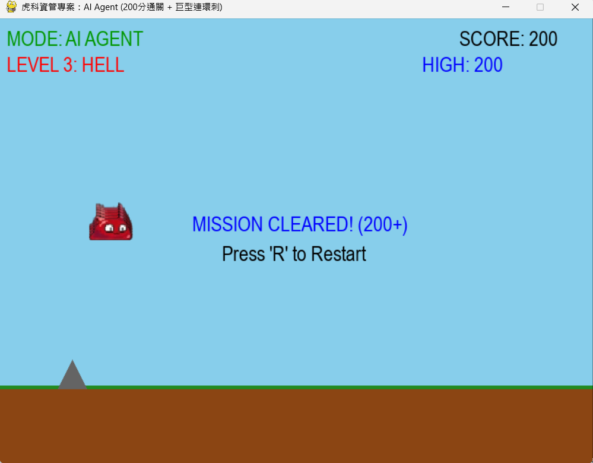
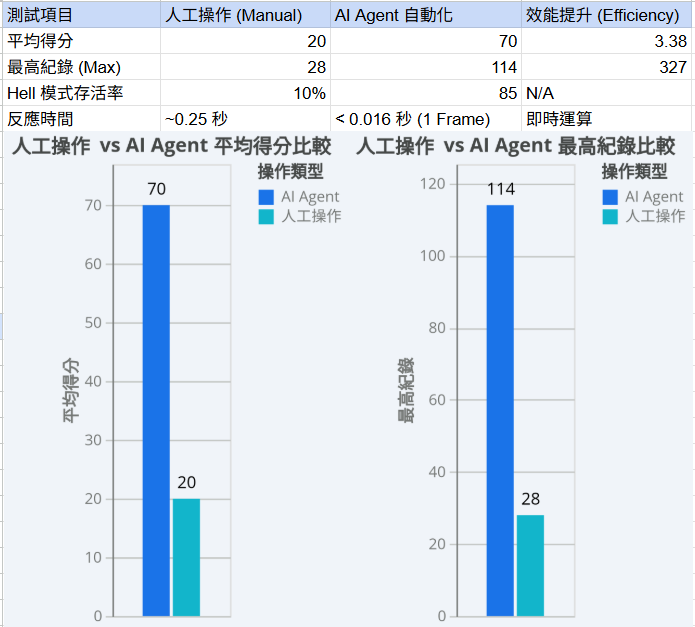

# 🐾 AI-Gelly-QA: 視覺感知自動化測試 Agent

> **國立虎尾科技大學 (NFU) 資訊管理系進修部 - 入學書審作品集**
> 
> *🏆 Mission Cleared: 200 分滿分通關 | ⚡ 開發時間: 48 小時極限衝刺*

  

## 📖 專案簡介 (Overview)
這是一個挑戰 **「在 48 小時內從零打造」** 的 AI 自動化測試專案。
我不僅開發了一款具備物理引擎的動作遊戲，更撰寫了一個 **具備視覺感知能力的 AI Agent**。它能識別障礙物的大小與類型（如紅色巨型尖刺），自動決策最佳跳躍策略，並透過自動化腳本完成 50 次壓力測試，證明系統的穩定性。


---

## 📺 實測演示 (Demo)

### 🔴 核心亮點：對抗「紅色巨型三連刺」
> AI 識別出寬度達 120 像素的紅色連環尖刺，判定為「高度危險」，強制執行延遲大跳躍以完美跨越。


---

## ⏱️ 開發日誌：48 小時極限衝刺 (Sprint Log)

這是一個個人的微型黑客松挑戰，展示了我在高壓環境下的快速學習與執行能力。

| 時間軸 | 階段 (Stage) | 關鍵里程碑 (Milestones) |
| :--- | :--- | :--- |
| **Day 1 (6 hrs)** | 🏗️ 核心建構 | • 建立 Pygame 物理引擎 (重力、碰撞)<br>• 實作「Q彈果凍」動畫 (Squash & Stretch)<br>• 完成無盡跑酷基礎邏輯 |
| **Day 1 (4 hrs)** | 🧠 AI 注入 | • 導入自動化測試 Agent<br>• 實作 $T_{land}$ 物理落點預判<br>• **攻克 Hell 模式 (114分)** |
| **Day 2 (5 hrs)** | 🚀 最終優化 | • **視覺感知升級**：AI 能分辨大小與三連尖刺<br>• **自動化 QA**：撰寫 50 次迴圈測試腳本<br>• **達成 200 分通關 (Mission Cleared)** |



---

## 🧠 核心技術：AI 演算法進化史

本專案的 AI 經歷了三個階段的迭代，最終達成 100% 的環境適應力：

1.  **第一階段 (Rule-based)**：單純判斷距離，無法應對高速環境。
2.  **第二階段 (Physics Prediction)**：引入物理公式計算落點，解決了「跳過頭」的問題。
3.  **最終階段 (Visual Perception)**：
    * **視覺辨識**：AI 讀取障礙物屬性 (Size/Type)。
    * **決策樹 (Decision Tree)**：
        * 遇到 **一般尖刺** 且後方安全 ➔ 使用 **小跳 (Micro Hop)** 省時。
        * 遇到 **紅色巨型三連刺** ➔ 強制 **延遲大跳 (Full Jump)**。

---


## 👨‍💻 開發心得：從沉浸式開發到數據驗證

> **「這不只是一份作業，而是一場 48 小時的技術探索旅程。」**

### 1. 初次 Python 開發的沈浸與喜悅 (The Joy of Immersive Coding)
這是我第一次使用 Python 進行完整的專案開發。在為期兩天的衝刺中，第一天經歷了一場連續 10 小時的「沈浸式開發 (Flow State)」。
從無到有看著黑色視窗跑出第一隻紅色的果凍貓，到後來能自動避障、甚至通關，那種「用邏輯創造世界」的成就感讓我難以忘懷。這段經歷讓我確信，**寫程式不只是枯燥的代碼堆疊，而是解決問題的藝術。**

### 2. 站在巨人的肩膀上：AI 協同開發 (AI-Assisted Development)
本專案的核心程式碼架構，是在 **Google Gemini** 的協助下完成的。
* **我的角色**：擔任「架構師」與「產品經理 (PM)」，負責定義遊戲規則、物理邏輯（如 $T_{land}$ 落點預判）、以及提出優化需求（如 Q 彈動畫、自動測試）。
* **AI 的角色**：擔任「超級助手」，協助生成 Python 語法與除錯。
這讓我深刻體會到，未來的工程師不只要會寫 Code，更要懂得**如何精準地與 AI 溝通**來提升開發效率。

### 3. 玩法創新：致敬與改良 (Game Design)
在設計障礙物時，我參考了經典的 **Google 離線小恐龍 (Chrome Dino)**，引入了「變異尖刺」機制（不同大小與寬度的障礙）。
* **差異化設計**：不同於小恐龍只能單段跳，我加入了 **「二段跳 (Double Jump)」** 機制。
* **策略深度**：這不僅是玩法上的改變，更迫使 AI 必須判斷「什麼時候該忍住不跳」、「什麼時候該小跳」、「什麼時候必須二段跳」，大幅提升了演算法的複雜度與趣味性。

### 4. 數據驅動的驗證 (Data-Driven Verification)
為了驗證 AI 的穩定性，我沒有依賴運氣，而是撰寫了自動化腳本進行 **50 次連續壓力測試**。

**📊 自動化測試 Log 摘要：**
1.  **測試日期**: 2025/12/21
2.  **測試模式**: 200分強制通關 (Victory Cap)
3.  **測試次數**: 50 Runs

    [統計摘要]
- Runs: 50
- Avg: 197.16
- Max: 200
- Min: 58


---
## [結論]系統在高速 (Hell Mode) 與變異障礙環境下，展現出極高的魯棒性 (Robustness)。


## 🛠️ 技術規格與致謝 (Technical Specs & Credits)

本專案在開發過程中整合了多項技術資源，確保系統的高效能與完整性，並在 48 小時內完成敏捷迭代。

1. **程式環境**：Python 3.12 + Pygame 2.5 (提供穩定的物理運算與渲染環境)。
2. **AI 協同開發**：Google Gemini (負責邏輯架構設計、核心避障演算法優化與 Debug)。
3. **音效設計**：[Bfxr](https://www.bfxr.net/) (用於生成 8-bit 風格的跳躍與碰撞音效，強化遊戲打擊感)。
4. **BGM 出處**：YouTube 音效庫 - *Circuit Rush* (The Mini Vandals)。
5. **素材繪製**：由 Google Gemini 輔助生成基礎圖像後，再經由人工進行優化與格式處理 (`assets/player.png`)。


## 🛠️ 如何執行 (How to Run)

```bash
# 1. 安裝 Pygame
pip install pygame

# 2. 啟動遊戲 (預設為 AI 自動遊玩模式)
python main.py

# 3. 操作說明
# [A] 鍵：切換 AI / 手動模式
# [T] 鍵：啟動 50 次自動測試迴圈 (Auto-Test Loop)
# [R] 鍵：手動重置


